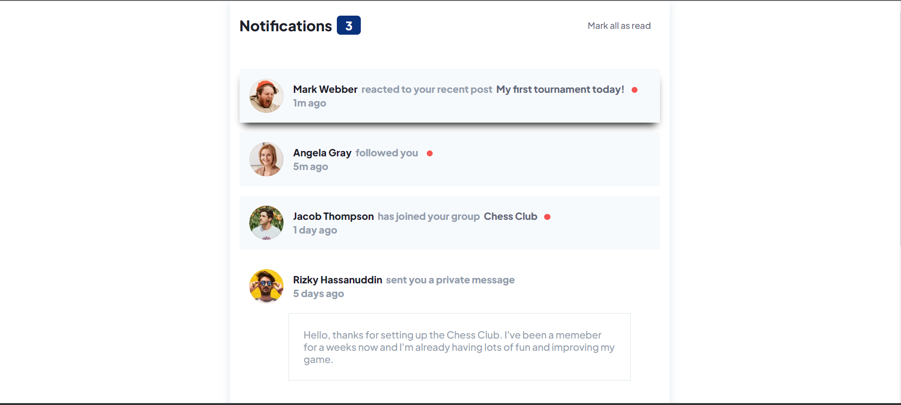

# Frontend Mentor - Notifications page



## Welcome! 👋


## Table of contents

- [Overview](#overview)
  - [Screenshot](#screenshot)
  - [Links](#links)
- [My process](#my-process)
  - [Built with](#built-with)
  - [What I learned](#what-i-learned)
- [Author](#author)
- [Acknowledgments](#acknowledgments)


## Overview


### Links

- Solution URL: []
- Live Site URL: [Notification Page](https://baayeh.github.io/notifications-page-main/)

## My process

### Built with

- Semantic HTML5 markup
- CSS custom properties
- Flexbox
- JavaScript
- Mobile-first workflow


### What I learned

I learned how to apply dynamic content using plain JavaScript

```JavaScript
function displayNotifications() {
  notifications.forEach(notification => {
    addNotificationToList(notification);
  });
}

function addNotificationToList(notification) {
  const li = `<li class="card">
    <div class="main-card ${notification.read && 'bg-color'}">
      
      <div class="card-body">
        <div>
          <p>
            <strong>${notification.name}</strong>
            <span class="reaction">${notification.reaction}</span>
            ${
              notification.description ? `<span class="description">${notification.description}</span>` : ''
            }
            ${
              !notification.read ? `<span class="rounded-badge"></span>` : ''
            }
          </p>
          ${
            notification.img ? `` : ''
          }
        </div>
        <p class="time">${notification.time}</p>
      </div>
    </div>
    ${
      notification.message ? `<p class="message">${notification.message}</p>` : ''
    }
  </li>`;
  ul.innerHTML += li;
}
```

## Author

- Website - [Kwasi Antwi Baayeh](https://baayeh.github.io/portfolio/)
- Frontend Mentor - [@Baayeh](https://www.frontendmentor.io/profile/Baayeh)
- Twitter - [@Cest_Baayeh](https://twitter.com/Cest_Baayeh)


## Acknowledgments

- Frontend Mentor
- [HTML-CSS-JS.COM](https://html-css-js.com/css/generator/box-shadow/)
